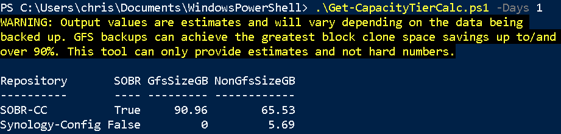

# Veeam Cloud Connect Capacity Tier Size Calculator

## Authors

* Mike Zollmann (@ZtechMike)
* Chris Arceneaux (@chris_arceneaux)

## Function

This script will gather information from a Veeam Cloud Connect Server and estimate how much space can be offloaded to Capacity Tier in a SOBR configuration. This script can only be used for a Standard Backup Repository or a SOBR where Capacity Tier is currently disabled.

**NOTE:** Output values are estimates and will vary depending on the data being
backed up. GFS backups can achieve the greatest block clone space savings up to/and over 90%. This tool can only provide estimates and not hard numbers.

## Known Issues

* _None_

## Requirements

* Veeam Cloud Connect
  * Veeam Backup & Replication 10
  * Veeam Backup Administrator account
* Script can be executed from the following locations:
  * Veeam Backup & Replication server (Cloud Connect)

## Usage

Get-Help .\Get-CapacityTierCalc.ps1

The output of the script is a PSObject showing each repository with the size of its corresponding GFS & Non-GFS backups that are to be offloaded if you enable Capacity Tier.

The key parameters you want are:

* **GfsSizeGB:** Size of GFS backups to be offloaded to Capacity Tier
* **NonGfsSizeGB:** Size of Non-GFS backups to be offloaded to Capacity Tier

Here is a sample output:

